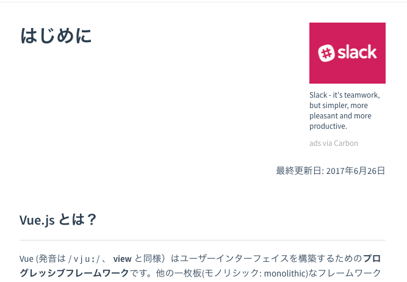

# Compared Tips

Gunma.web #28 
@kanayannet

---

# 自己紹介

- 氏名: 金澤 宏昭
- twitter: @kanayannet
- facebook: HiroakiKanazawa

# What's Compare

- 比較という意味
- 比較対象
    - Vue と Angular
    - 比較できるほど詳しくない
        - 他の人の記事を参考にしながら..

## なぜ話すのか?

- Vue と Angular よく解ってない

## どの程度解ってないのか?

- チュートリアルをそれぞれやった程度

## チュートリアル?

- Vue.js
    - https://jp.vuejs.org/v2/guide/
- Angular
    - https://angular.io/tutorial

## 早速ですが...

- Vue.js は最新版のチュートリアルに日本語がある
    - うれしいですね。

## 最終更新日

## もちろん

- これだけで終わりません。
- きちんとやりますよ。

# 1st

- ソース
    - Vue.js 公式サイト
        - https://jp.vuejs.org/v2/guide/comparison.html

## 1st

- いくつかの Vue の構文は AngularJS と非常に良く似ているように見える
    - 例 : v-if と ng-if

## 1st

- API と設計の両方の観点から、Vue は AngularJS と比較してとても単純です。
- 重要なアプリケーションを構築するために十分学ぶのには大抵 1 日もかからないでしょう。

## 1st

- 「大抵 1 日もかからないでしょう。」

## 1st

- 本当か?
    - 試しにチュートリアルをやり始める
        - 4-5時間経過
            - 終わらないよ汗
        - 翌日
            - あと少しで終わりそう...

## 1st

- よく見ると..
    - 「大抵」１日
        - 俺が未熟者なのかな〜汗

# 2st

- ソース元
    - React、Angularになじめなかった僕に手を差し伸べてくれたVue.js
        - http://qiita.com/samuraikun/items/bb2939296bbead341293

## 2st

- Angularで違和感を感じた部分をVue.jsが補っている部分があるから人気が出ているかなあと感じた。

## 2st

- どこの部分?
    - 試しにチュートリアルの初めで比較

## 2st

- Angular
    - git clone https://github.com/angular/quickstart.git quickstart
    - cd quickstart
    - npm install
    - npm start    

## 2st

- ああ、なるほど。
- node(npm) 当たり前の世界になってるのね。

## 2st

- ちなみに vue はこう

<pre>
    
</pre>
